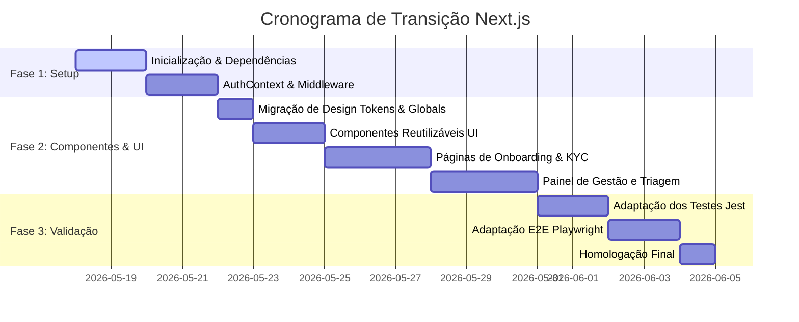

# Plano de Refatoração: Migração para Next.js (App Router) — Reserva Serviços

Este plano documenta a estratégia, arquitetura e passos de execução para migrar a plataforma **Reserva Serviços** de sua estrutura legada de arquivos HTML estáticos monolíticos e acoplados (`/public/`) para uma aplicação moderna em **Next.js (React + App Router)**.

---

## 1. Motivação e Objetivos

A implementação inicial baseada em arquivos HTML puros e Web Components nativos cumpriu o papel de validação visual rápida, mas gerou um **alto acoplamento técnico** e problemas de manutenibilidade:
*   **Monólitos em HTML:** Telas complexas como `gestor-painel.html` (56KB) e `prestador-onboarding.html` (74KB) misturam estilização ad-hoc, tags de script massivas, manipulação direta de DOM e lógica de autenticação/banco no mesmo arquivo.
*   **Replicação de Estado:** O estado de autenticação e dados é manipulado individualmente por escutas globais de DOM, dificultando a sincronização em tempo real e reatividade fluida.
*   **Dificuldade de Testes:** Testar interfaces complexas e fluxos reativos acoplados em HTML puro exige testes de integração pesados de ponta a ponta (E2E Playwright), limitando testes unitários rápidos.

### Objetivos do Next.js no Reserva Serviços:
1.  **Componentização Declarativa:** Separar UI, lógica de negócios e chamadas ao Supabase em componentes React limpos e tipados/isolados.
2.  **Roteamento Centralizado:** Substituir redirecionamentos de janela (`window.location`) pelo roteamento nativo client-side (`/src/app`) com proteção de rotas via Middleware.
3.  **Gerenciamento de Estado Reativo:** Usar React Context e hooks dedicados para sessões do Supabase Auth e estados globais.
4.  **Estética Premium Nativa:** Organizar e otimizar CSS Modules ou Tailwind sem overhead de processamento na máquina do usuário.

---

## 2. Nova Arquitetura de Pastas (Next.js)

Propomos a transição para a estrutura padrão recomendada do Next.js utilizando a pasta `/src` e o **App Router**:

```
/
├── .gemini/                       # Instruções e Melhoria Contínua dos Agentes
├── docs/                          # Documentação e PRDs
├── supabase/                      # Migrações e Edge Functions locais
├── package.json                   # Dependências do Next.js e Scripts
├── tailwind.config.js             # Configurações do Tailwind (opcional/se adotado)
└── src/
    ├── app/                       # Next.js App Router (Páginas e Layouts)
    │   ├── layout.js              # Layout global com Fontes, Design Tokens e Contextos
    │   ├── page.js                # Landing Page institucional com Simulador Integrado
    │   ├── login/
    │   │   └── page.js            # Tela de autenticação unificada (Morador/Prestador)
    │   ├── gestor/
    │   │   ├── layout.js          # Layout restrito com barra de navegação administrativa
    │   │   └── painel/
    │   │       └── page.js        # Workstation de Triagem de Prestadores
    │   ├── prestador/
    │   │   ├── onboarding/
    │   │   │   └── page.js        # Jornada Mobile de cadastro e KYC (Selfie/Documentos)
    │   │   └── dashboard/
    │   │       └── page.js        # Área restrita do profissional (Diárias/Perfil)
    │   └── morador/
    │       └── dashboard/
    │           └── page.js        # Área de agendamento e liberação condominial
    ├── components/                # Componentes React Reutilizáveis (UI Core)
    │   ├── ui/                    # Componentes de base (Botões, Inputs, Badges)
    │   │   ├── Button.js
    │   │   ├── Input.js
    │   │   └── Badge.js
    │   ├── shared/                # Componentes compartilhados de negócio
    │   │   ├── Header.js
    │   │   ├── Footer.js
    │   │   └── ClipboardCard.js
    │   └── gestor/                # Componentes específicos do painel admin
    │       ├── CandidateCard.js
    │       ├── DocumentViewer.js
    │       └── TriagingDesk.js
    ├── contexts/                  # React Contexts (Autenticação e Estado do App)
    │   └── AuthContext.js         # Provedor seguro de sessão com Supabase Client
    ├── services/                  # Clientes de Serviços de API
    │   └── supabase.js            # Cliente Supabase singleton pré-configurado
    ├── utils/                     # Funções utilitárias puras
    │   ├── formatters.js          # Formatadores de CPF, CEP, WhatsApp
    │   └── validators.js          # Validadores regex e validações de negócio
    └── middleware.js              # Middleware do Next.js para proteção de rotas restritas
```

---

## 3. Mapeamento da Migração de Componentes

| Elemento Legado (HTML/JS) | Destino no Next.js (React) | Responsabilidade e Melhorias |
| :--- | :--- | :--- |
| `public/index.html` | `src/app/page.js` | Landing Page. O simulador de Milestone 1 será integrado como um componente dinâmico interativo local. |
| `public/prestador-onboarding.html` | `src/app/prestador/onboarding/page.js` | Tela de KYC do prestador. A lógica de uploads será movida para um Hook customizado `useKYCUpload`. |
| `public/gestor-painel.html` | `src/app/gestor/painel/page.js` | Painel de triagem administrativo. Desacoplado em subcomponentes menores (`CandidateList`, `TriageViewer`). |
| `public/login.html` | `src/app/login/page.js` | Centralização das credenciais com tratamento de roles e redirecionamento seguro pós-login. |
| `public/js/components/clipboard-card.js` | `src/components/shared/ClipboardCard.js` | Web Component reescrito em React funcional simples com reatividade baseada em `useState`. |
| `public/js/utils/formatters.js` | `src/utils/formatters.js` | Funções exportadas diretamente, com testes unitários adaptados no Jest para execução sem JSDOM completo. |
| `public/js/services/supabase.js` | `src/services/supabase.js` | Adaptação para uso do cliente padrão e hooks de autenticação Next.js. |

---

## 4. Plano de Transição Técnica e Desenvolvimento

A transição será executada em fases, garantindo que o servidor local continue operando perfeitamente e que os testes atuais sejam adaptados de forma incremental.

### Fase 1: Inicialização do Next.js e Setup do Projeto (Fundações)
1.  **Inicializar App Next.js:** Executar a inicialização do Next.js na raiz do projeto em modo não interativo utilizando `npx -y create-next-app@latest ./ --src-dir --app --use-npm --js` (ou TypeScript, conforme preferência).
2.  **Instalação de Dependências:** Configurar chaves no arquivo `.env` para o Next.js ler as variáveis de desenvolvimento local (`NEXT_PUBLIC_SUPABASE_URL` e `NEXT_PUBLIC_SUPABASE_ANON_KEY`).
3.  **Configurar Provedor de Autenticação:** Criar `AuthContext.js` na pasta `/src/contexts` para escutar e compartilhar a sessão do Supabase Auth com todos os componentes da árvore.
4.  **Criar Middleware de Segurança:** Desenvolver `middleware.js` na raiz do Next.js para interceptar acessos às rotas `/gestor/*`, `/prestador/*` e `/morador/*`, redirecionando usuários não autenticados ou com roles incompatíveis de volta para a tela de `/login`.

### Fase 2: Migração das Páginas e Componentização (UI Core)
1.  **Migrar Design Tokens (CSS):** Mover variáveis e estilos base de `style.css` para `src/app/globals.css`, integrando a paleta premium Obsidian & Jade nas novas páginas.
2.  **Recriar Componentes UI em React:** Desenvolver componentes declarativos e funcionais baseados na estrutura estática antiga:
    *   `<Button />` com micro-animações CSS e transições suaves.
    *   `<ClipboardCard />` com feedbacks reativos.
3.  **Construir Página de Onboarding do Prestador (`/prestador/onboarding`):** Migrar o fluxo passo a passo de KYC de segurança para React (upload da foto da selfie, foto de CNH e atestado criminal).
4.  **Construir Painel de Gestão (`/gestor/painel`):** Refatorar o workstation em React, subdividindo a fila de triagem dinâmica (triagem, ativos, inativos, banidos), visualizador de documentos e controle de checklists.

### Fase 3: Ajustes nos Testes e Qualidade (QA)
1.  **Testes Unitários (Jest):** Migrar testes unitários antigos para cobrir os utilitários e os novos hooks do React.
2.  **Testes E2E (Playwright):** Atualizar as rotas e seletores de teste no arquivo `tests/e2e/onboarding.spec.js` para apontar para a nova estrutura do Next.js rodando localmente na porta 3000.

---

## 5. Cronograma e Entregas Sugeridas (Milestones)

> [!IMPORTANT]
> **Foco em Não Quebrar a Infraestrutura Supabase:** Todo o desenvolvimento local do Supabase via Docker (Banco, Auth, RLS, Edge Functions) permanecerá **100% inalterado** e compatível. A transição foca puramente no desacoplamento da camada de apresentação (Frontend).



---

## 6. Escopo Detalhado de Módulos e Funcionalidades

O sistema Next.js será subdividido em 5 módulos lógicos de negócio de alta coesão e baixo acoplamento:

### 1. Módulo de Autenticação e Segurança (`Auth & Guard Module`)
*   **Responsabilidade:** Autenticação segura de usuários com controle estrito de acessos baseado em roles de banco (`master`, `operator`, `provider`, `candidate`).
*   **Escopo de Arquivos:**
    *   `src/contexts/AuthContext.js`: Compartilha o estado global da sessão da API Supabase Auth, carrega dados do perfil (`profiles`) e exporta hooks reativos `useAuth()`.
    *   `src/app/login/page.js`: Página com formulário reativo unificado de login com tratamento sofisticado de erros (credenciais incorretas, falta de conexão local, etc.).
    *   `src/middleware.js`: Interceptor de requisições que redireciona usuários para `/login` caso tentem acessar rotas não autorizadas (ex: morador tentando acessar `/gestor/painel`).

### 2. Módulo de Onboarding & KYC de Prestadores (`Onboarding & KYC Module`)
*   **Responsabilidade:** Jornada mobile passo a passo para novos prestadores realizarem cadastro físico, uploads de KYC e termos legais.
*   **Escopo de Arquivos:**
    *   `src/app/prestador/onboarding/page.js`: Roteamento e controlador principal da máquina de estado do onboarding (Etapa 1: Dados Básicos, Etapa 2: Selfie Facial, Etapa 3: CNH, Etapa 4: Atestado PC-SP, Etapa 5: LGPD).
    *   `src/hooks/useKYCUpload.js`: Hook para gerenciar as operações assíncronas de upload de imagens e arquivos PDF temporários no Supabase Storage.

### 3. Módulo Workstation do Gestor (`Manager Workstation Module`)
*   **Responsabilidade:** Painel operacional de auditoria com sincronização reativa em tempo real para controle condominial e liberação de acesso.
*   **Escopo de Arquivos:**
    *   `src/app/gestor/painel/page.js`: Interface de coluna dupla com filtros dinâmicos por abas (Triagem, Ativos, Inativos, Banidos).
    *   Lógica de integração com a Supabase Edge Function remota de expurgo automático de KYC sensível após homologação.

### 4. Módulo do Morador e Agendamentos (`Resident Hub Module`)
*   **Responsabilidade:** Descoberta de profissionais homologados, calendário de agendamento de diárias e liberação condominial.
*   **Escopo de Arquivos:**
    *   `src/app/morador/dashboard/page.js`: Dashboard principal do morador.
    *   Lógica de validação em banco da **Trava Trabalhista (LC 150/2015)** impedindo que o mesmo prestador realize mais de 2 serviços na semana para o mesmo cliente.

### 5. Módulo Core de Infraestrutura (`Core & Services Module`)
*   **Responsabilidade:** Configurações singletion de APIs externas, formatação reativa e validações regex seguras.
*   **Escopo de Arquivos:**
    *   `src/services/supabase.js`: Inicialização e exportação do cliente `@supabase/supabase-js`.
    *   `src/utils/formatters.js`: Formatadores de texto puro (CPF, Telefone, WhatsApp, CEP, Valores Monetários).
    *   `src/utils/validators.js`: Validadores (CPF, e-mail corporativo).

---

## 7. Catálogo de Componentes e Organização Atômica

Para assegurar reusabilidade e blindar o visual premium da interface, dividimos os componentes React de forma estruturada:

### A. Componentes Atômicos UI (`src/components/ui/`)
Componentes visuais genéricos sem lógica de negócios, focados em tokens de design puro:
*   `Button.js`: Suporta variantes (`brand`, `danger`, `glass`), estados de carregamento (Spinner interno) e micro-animações reativas de hover e clique.
*   `Input.js`: Input estilizado com foco luxuoso, ícone flexível à esquerda, máscara opcional e controle reativo de validação/erros.
*   `Badge.js`: Rótulos reativos com gradientes suaves correspondentes aos status (`Aprovado` $\rightarrow$ Jade, `Pendente` $\rightarrow$ Bronze, `Banido/Inativo` $\rightarrow$ Crimson).
*   `Modal.js`: Container de overlay com animação de fade-in e blur fosco no fundo (`backdrop-filter`).
*   `Spinner.js`: Indicador animado de progresso assíncrono.

### B. Componentes Compartilhados de Negócio (`src/components/shared/`)
Componentes compostos que implementam fluxos de negócio reusados em mais de uma jornada:
*   `Header.js`: Menu responsivo premium com controle de rotas, branding Reserva Serviços e atalho para logout.
*   `Footer.js`: Rodapé corporativo com link para Termos de Uso e declaração LGPD.
*   `ClipboardCard.js`: Card de visualização rápida de prestadores aprovados com botão dinâmico para cópia imediata de dados condominiais e alertas micro-animados.
*   `RatingStars.js`: Estrelas interativas para renderização e submissão de notas operacionais.
*   `EvidenceTracker.js`: Widget de geolocalização e check-in para segurança contra chargebacks fraudulentos.

### C. Componentes de Funcionalidades Específicas (`src/components/features/`)
Componentes complexos autocontidos que pertencem exclusivamente a uma funcionalidade ou fluxo:
*   **Autenticação (`src/components/features/auth/`):**
    *   `LoginForm.js`: Form de login com tratamento local de validação e feedback de erro premium.
*   **Onboarding (`src/components/features/onboarding/`):**
    *   `KYCStepSelfie.js`: Painel com câmera ativa ou upload para selfie KYC do prestador.
    *   `KYCStepDocument.js`: Upload e visualização da CNH oficial.
    *   `KYCStepBackground.js`: Upload e checklist para o atestado de antecedentes.
*   **Gestor (`src/components/features/gestor/`):**
    *   `CandidateQueue.js`: Lista vertical de candidatos reativa ao canal de websockets PostgreSQL.
    *   `CandidateCard.js`: Card da fila com avatar, nome, e status.
    *   `TriageDesk.js`: Interface central detalhada de triagem física.
    *   `DocumentViewer.js`: Componente sherdder de documentos com controle de PDF em nova aba.

---

## 8. Estrutura e Práticas de Código

1.  **Separação entre Client e Server Components:**
    *   Por padrão, todas as páginas em `src/app/` que utilizam lógica interativa (como forms, uploads e botões com `useState`/`useEffect`) serão marcadas com a diretiva `"use client"` no topo.
    *   Layouts e configurações de metadados SEO estáticos serão mantidos como Server Components para maior velocidade de indexação e renderização.
2.  **Modularização Estrita:**
    *   Componentes específicos de uma feature **nunca** importam arquivos ou estados de outros módulos de features sem passar pelo `AuthContext` ou componentes compartilhados.

---

## 9. Próximos Passos Obrigatórios (Aprovação)

Para iniciar a execução prática imediata, solicitamos a validação do Operador:
1.  **Aprovar o escopo detalhado:** A divisão modular e o catálogo de componentes React atendem perfeitamente à sua necessidade de organização?
2.  **Escolha do Processador de Estilos:** Deseja utilizar **Tailwind CSS nativo** ou prefere estruturar os componentes com **CSS Modules Vanilla** usando nosso arquivo `style.css` legado como base de design tokens?
3.  **Uso de TypeScript:** Prefere criar a estrutura Next.js com suporte nativo a **TypeScript** para blindagem contra erros de tipos nas props ou manter em **JavaScript puro (ES6)**?

Aguardamos seu direcionamento para disparar as fases de **Setup de Arquitetura & Implementação** com o time!
