# Design System & Experiência de Jornadas: Reserva Serviços
> Versão: 1.0.0  
> Status: Aprovado para Engenharia e UI  
> Autor: @ux-ui (Designer UX/UI Sênior)  

Este documento reúne o **Design System Visual Premium**, a definição de **Personas**, **Jornadas do Usuário** e **Tom de Voz** segmentados para os 4 perfis centrais da nossa plataforma Next.js: **Cliente (Morador)**, **Prestador (Profissional Autônomo)**, **Gestor (Suporte Local)** e **Master (Global Admin)**, sob a denominação oficial de **Reserva Serviços**.

---

## 👥 1. Definição de Personas e Tom de Voz

### 🅰️ Persona 1: O Cliente (Morador do Reserva Raposo)
*   **Nome:** Júlia Lima, 32 anos.
*   **Perfil:** Advogada associada, casada, com 1 filho pequeno. Trabalha em regime híbrido.
*   **Motivações:** Precisa de uma casa limpa e consertos rápidos sem perder horas procurando indicações não-triadas no WhatsApp do condomínio.
*   **Dores:** Medo de colocar desconhecidos em casa; frustração com a burocracia de liberar prestadores na portaria do megacomplexo; falta de tempo para gerenciar pagamentos.
*   **Tom de Voz do App para o Cliente:** **Acolhedor, Seguro, Extremamente Prestativo e Polido.** 
    *   *Exemplo de Cópia:* *"Fique tranquilo, Júlia. O prestador Carlos foi verificado e aprovado por nossa equipe de segurança local. Ele estará na sua torre em 15 minutos."*

### 🅱️ Persona 2: O Prestador (Profissional Autônomo Hiperlocal)
*   **Nome:** Carlos Santos, 45 anos.
*   **Perfil:** Diarista e técnico autônomo. Mora nas proximidades da Raposo Tavares.
*   **Motivações:** Quer realizar serviços a passos de caminhada (sem trânsito nem gastos de condução) e receber o dinheiro imediatamente após o trabalho para pagar as contas do dia.
*   **Dores:** Ser explorado por taxas abusivas de antecipação; ter que esperar 30 dias para sacar o suor do seu trabalho; custos elevados de transporte público em São Paulo.
*   **Tom de Voz do App para o Prestador:** **Empoderador, Claro, Dignificante e Transparente.**
    *   *Exemplo de Cópia:* *"Carlos, parabéns pelo serviço concluído na Torre B! Seus R$ 80,00 líquidos já estão disponíveis na sua carteira. Toque abaixo para sacar via PIX instantâneo e gratuito."*

### 🅲 Persona 3: O Gestor (Operador de Suporte Local do Condomínio)
*   **Nome:** Mariana Alves, 29 anos.
*   **Perfil:** Analista de atendimento dedicada às torres do Reserva Raposo.
*   **Motivações:** Monitorar a integridade das operações diárias, validar cadastros de prestadores em menos de 10 minutos e resolver pequenos atritos/avarias de forma ágil e amigável.
*   **Dores:** Sobrecarga de aberturas de sinistros; ferramentas de triagem de documentos complexas e confusas; medo de vazamento de dados de atestados criminais (LGPD).
*   **Tom de Voz do App para o Gestor:** **Eficiente, Pragmático, Alocado e Focado em Produtividade.**
    *   *Exemplo de Cópia:* *"Mariana, há 3 atestados de antecedentes aguardando triagem. Lembre-se: os arquivos físicos em PDF serão apagados permanentemente do servidor no momento em que você clicar em 'Aprovar'."*

### 🅳 Persona 4: O Master (Administrador Global / Ivan)
*   **Nome:** Ivan Santos, 38 anos.
*   **Perfil:** Fundador e principal investidor (Bootstrapper).
*   **Motivações:** Monitorar os indicadores de saúde financeira (GMV, volume de diárias, margem operacional líquida do Asaas Split), acompanhar o crescimento e auditar o Fundo Mutualista.
*   **Dores:** Falta de clareza em chargebacks sofridos; bitributação tributária indevida; lentidão na tomada de decisões estratégicas de escala.
*   **Tom de Voz do App para o Master:** **Analítico, Altamente Técnico, Orientado a Dados e Estratégico.**
    *   *Exemplo de Cópia:* *"Seu GMV acumulado nas últimas 24 horas no Reserva Raposo foi de R$ 12.500,00 com split tributado no Simples Nacional a uma taxa efetiva de 6% sobre sua comissão. Fundo Mutualista saudável em R$ 4.500,00."*

---

## 🗺️ 2. Mapeamento das Jornadas do Usuário (Next.js Flow)

```mermaid
graph TD
    subgraph Cliente [Jornada do Cliente]
        C1["Acessar App & Solicitar Limpeza/Reparo"] --> C2["Visualizar Match com Foto/RG/CPF"]
        C2 --> C3["Botão 'Copiar Dados Portaria' & Colar no App do Condomínio"]
        C3 --> C4["Serviço Concluído -> Liberar PIX no Asaas"]
    end
    subgraph Prestador [Jornada do Prestador]
        P1["Cadastrar CPF & Selfie & Atestado Antecedentes"] --> P2["Receber Alerta de Match no Reserva Raposo"]
        P2 --> P3["Fazer Check-in por GPS -> Executar Serviço -> Check-out com Foto"]
        P3 --> P4["Visualizar Saldo Líquido de R$ 80,00 -> Saque Instantâneo PIX"]
    end
    subgraph Gestor [Jornada do Gestor]
        G1["Receber Novo Cadastro de Autônomo"] --> G2["Triar Documentos & Validar Atestado Criminológico"]
        G2 --> G3["Aprovar Cadastro -> Deleção do PDF do Servidor (LGPD)"]
        G3 --> G4["Monitorar Alertas de Cancelamento/Disputa de Avarias"]
    end
    subgraph Master [Jornada do Master]
        M1["Acessar Torre de Controle Financeira"] --> M2["Auditar Split do Asaas & Impostos Simples Nacional"]
        M2 --> M3["Monitorar Taxas de Conversão & CAC por Bloco/Torre"]
        M3 --> M4["Autorizar Repasses de Reversão de Chargeback para o Fundo Mutualista"]
    end
```



---

## 🎨 3. Design System Visual (Tokens CSS Premium)

A identidade visual do app foi criada para exalar **segurança de ferro (Slate/Stone), riqueza e prosperidade financeira (Emerald/Jade) e toques elegantes de ouro (Amber/Gold)** para realçar o caráter premium do megacomplexo residencial, fugindo completamente de layouts genéricos azulados e brancos.

### A. Paleta de Cores (CSS Variables / Tailwind Theme)
```css
:root {
  /* Tons Neutros de Luxo (Obsidian Dark Mode como Base Fina) */
  --bg-primary: #07090e;     /* Obsidian Negro Profundo (Absoluto e Elegante) */
  --bg-secondary: #0f131f;   /* Graphite Slate para Cards e Modais Translúcidos */
  --bg-tertiary: #192033;    /* Steel Gray para inputs, bordas e divisores discretos */
  
  /* Cores de Prestígio e Confiança */
  --color-brand: #059669;    /* Emerald Jade Premium (Dinheiro Limpo, Crescimento e Segurança) */
  --color-brand-hover: #047857;
  --color-brand-light: #34d399; /* Mint Bright para acentos de sucesso rápidos */
  --color-accent: #d97706;   /* Bronze Ocre / Amber Gold (Alta Sofisticação, Fundo Mutualista) */
  --color-accent-light: #f59e0b; /* Ouro Puro para badges e micro-conversões */
  
  /* Feedback Semântico Polido */
  --color-success: #10b981;  /* Emerald standard */
  --color-error: #ef4444;    /* Crimson Red suave */
  --color-info: #3b82f6;     /* Royal Blue sóbrio */
  
  /* Cores de Texto de Alto Contraste */
  --text-primary: #f8fafc;   /* Slate White brilhante */
  --text-secondary: #cbd5e1; /* Cool Slate para textos secundários longos */
  --text-muted: #64748b;     /* Muted Slate para rótulos secundários e desabilitados */
}
```

### B. Tipografia (Google Fonts: Outfit & Inter)
*   **Headings (Títulos/Headers):** Fonte **Outfit** (Moderna, Premium, com curvas geométricas elegantes).
    *   *Propósito:* Transmitir sofisticação e modernidade na marca.
*   **Body Text (Textos e Tabelas):** Fonte **Inter** (Líder em legibilidade de dados densos e interfaces mobile).
*   **Escala de Tamanhos:**
    *   `h1`: 2.25rem (36px) | `font-semibold` | `tracking-tight`
    *   `h2`: 1.5rem (24px) | `font-semibold`
    *   `h3`: 1.25rem (20px) | `font-medium`
    *   `body-large`: 1rem (16px) | `font-normal`
    *   `body-small`: 0.875rem (14px) | `font-normal`
    *   `micro`: 0.75rem (12px) | `font-medium` (usado para taxas e tags)

### C. Glassmorphism & Efeitos Visuais (Premium Feel)
Para dar o tom de "App de Elite", os cards do Next.js utilizarão bordas sutis e fundo translúcido:
```css
.card-glass {
  background: rgba(19, 27, 46, 0.7);
  backdrop-filter: blur(12px);
  border: 1px solid rgba(255, 255, 255, 0.05);
  box-shadow: 0 8px 32px 0 rgba(0, 0, 0, 0.37);
  border-radius: 16px;
}
```

---

## 📱 4. Protótipos de UI & Estrutura de Telas (Next.js Web App)

Abaixo, descrevemos a arquitetura visual e os elementos obrigatórios de interface de cada jornada:

### 📱 A. A Interface do Cliente (Jornada Segura e Rápida)
*   **Página Principal:** Minimalista. Um cabeçalho com *"Olá, Júlia - Torre 12, Apto 14"* e uma seleção de 3 grandes cards com ícones personalizados:
	*   `[ Limpeza Residencial ]` `[ Passar Roupas ]` `[ Pequenos Reparos (Ruidoso/Silencioso) ]`
*   **Tela de Match Confirmado (O Coração da Confiança):**
	*   Card central com foto do prestador Carlos Santos, com o selo dourado: `[✓ Profissional Verificado - Reserva Serviços]`.
	*   Exibição em destaque do RG e CPF dele.
	*   **Botão Destaque Ouro:**
        ```html
        <button class="bg-amber-500 text-slate-900 font-bold py-3 px-6 rounded-lg w-full flex items-center justify-center gap-2 hover:bg-amber-600 transition">
          <svg>...</svg> Copiar Dados para Portaria
        </button>
        ```
    *   *UX Feedback:* Ao clicar, exibe um toast animado: *"Dados copiados! Agora cole no WhatsApp da portaria para liberar o Carlos."*

---

### 🔨 B. A Interface do Prestador (Jornada da Dignidade e Carteira Líquida)
*   **Tela de Alerta de Match (Jornada Uber-like):**
    *   Pop-up com sinalização vibrante contendo o Bloco/Torre do serviço, horário e o valor **R$ 80,00 Líquidos no PIX**.
    *   Duas opções de botão de tamanho confortável para dedos humanos: `[ Recusar ]` (cinza) e `[ ACEITAR CHAMADO ]` (verde brilhante animado).
*   **Tela de Acompanhamento (Logs de Evidência e GPS):**
    *   Botão gigante verde de **"INICIAR SERVIÇO"** (capta coordenada GPS e timestamp).
    *   Ao finalizar, o prestador clica em **"FINALIZAR SERVIÇO"** e abre a câmera nativa do celular solicitando 2 fotos rápidas do trabalho executado (prova contra chargeback).
*   **Painel "Minha Carteira" Asaas:**
    *   Visualização limpa e redonda: *"Seu Saldo Líquido de Hoje: R$ 160,00"*.
    *   Botão em destaque: **"Sacar via PIX Instantâneo"** (Repasse direto via Asaas API em menos de 10 segundos).

---

### 🛡️ C. O Painel do Gestor (Eficiência Operacional Local)
*   **Dashboard Administrativo da Torre do Reserva Raposo:**
    *   Painel de controle com duas colunas: esquerda para cadastro de novos autônomos e direita para suporte operacional.
*   **Checklist de Triagem Jurídica (Compliance LGPD):**
    *   Ficha do profissional contendo documento de identidade em tela cheia e o arquivo PDF do Atestado de Antecedentes Criminais.
    *   A Mariana (Gestora) faz a checagem manual de validade.
    *   Abaixo, há o botão de aprovação: `[ APROVAR E DELETAR ANTECEDENTES ]`. 
    *   *UX Safeguard:* Um pop-up surge com um aviso de privacidade: *"Atenção: Ao aprovar, o arquivo PDF do atestado será deletado fisicamente do servidor para cumprir a LGPD. Apenas a flag is_verified permanecerá ativa no banco de dados. Confirmar?"*

---

### 📊 D. A Control Tower do Master (O Painel do Ivan)
*   **Dashboard Financeiro Global de Saúde:**
    *   Métricas de alto impacto em cards com gradientes elegantes:
        *   `GMV Total` | `Comissões Coletadas (20%)` | `Volume de Split Concluído`
        *   `Fundo Mutualista Ativo (1.5%)` | `Total de Impostos NFS-e (6%)`
    *   **Gráfico de Tendências de Conversão e CAC:** Mostra o custo de tráfego pago por bloco/torre, identificando em quais áreas do complexo o app está mais forte.
    *   **Módulo de Defesa de Chargebacks:** Uma tabela listando transações contestadas. Cada linha possui o botão `[ Gerar Log de Defesa ]`. Ao clicar, o Next.js consolida automaticamente o PDF com o GPS do prestador, as fotos de antes/depois enviadas pelo app e os logs de clipboard de portaria do morador, pronto para envio direto à API do Asaas/Adquirente para recuperar o dinheiro.

---

## 🚀 5. Micro-Interações e Acessibilidade (WCAG 2.1 AAA Compliant)

A excelência de um produto digital premium se revela no cuidado com as transições de estado, na resposta táctil de suas interfaces e no respeito à diversidade de acessibilidade física e visual de seus usuários.

### A. Catálogo de Micro-Interações Premium
1.  **Estados Interativos dos Botões (Hover & Active States):**
    *   *Normal:* Fundo esmeralda sólido (`#10b981`), texto off-white.
    *   *Hover:* Escalonamento suave de escala `scale(1.02)` e mudança de cor para `#059669` em transição linear de 150ms.
    *   *Active (Toque/Clique):* Compressão sutil `scale(0.97)` com feedback de sombra interna (inset shadow) para simular um botão físico sendo pressionado.
    *   *Disabled:* Opacidade reduzida para 40% (`opacity: 0.4`), cursor do mouse alterado para `not-allowed`, desativando qualquer animação de hover.
2.  **O "Clipboard Wizard" (Botão Copiar Dados):**
    *   Ao clicar em *"Copiar Dados para Portaria"*, o botão muda de cor instantaneamente de Amber dourado para Verde Esmeralda, alterando seu texto de *"Copiar"* para *"✓ Copiado!"*.
    *   Um micro-efeito de partículas sutil (confetes em CSS leve) é disparado ao redor do botão, acompanhado por um Toast flutuante com entrada em slide-up de 300ms contendo a mensagem: *"Dados na área de transferência. Agora é só colar no WhatsApp do condomínio!"*. Após 3 segundos, o botão retorna suavemente ao estado original.
3.  **Transição de Carregamento Financeiro Asaas (Skeleton Loaders):**
    *   Nunca utilizar spinners secos sobre tela em branco. Quando os dados financeiros estiverem carregando, os cards de saldo e a listagem de repasses exibirão **Skeletons Pulsantes** com degradê animado em loop infinito (duração de 1.5s, transição suave de opacidade entre 30% e 70%) com a mesma silhueta dos cards finais.
4.  **Haptic Feedback (Táctil no Mobile):**
    *   Para dispositivos iOS e Android nativos (empacotados via PWA), a aceitação de chamados ou liberação de pagamentos disparará uma vibração de confirmação curta (`vibrate(20ms)` para matches e `vibrate([40ms, 20ms, 40ms])` para saques concluídos), gerando satisfação física ao receber o dinheiro.

### B. Diretrizes Estritas de Acessibilidade (WCAG 2.1)
1.  **Navegação por Teclado Completa (Focus Ring):**
    *   Qualquer elemento interativo (botões, links, inputs) deve ser 100% acessível via tecla `Tab`.
    *   *Focus State:* O foco visual é demarcado por um anel externo duplo brilhante: borda interna de `#0a0f1d` (2px) e anel externo de `#10b981` (3px) para garantir contraste absoluto sobre fundos escuros.
2.  **Leitores de Tela (Aria Attributes):**
    *   Imagens de avatares de prestadores devem conter tags alt dinâmicas, ex: `alt="Foto de perfil de Carlos Santos, prestador verificado"`.
    *   Status dinâmicos de split financeiro e matching dinâmico devem possuir o atributo `aria-live="polite"` para que o leitor de tela anuncie a conclusão ou a chegada de um match sem interromper a navegação atual do usuário.
3.  **Suporte à Redução de Movimento (Motion Reduction):**
    *   O Next.js/CSS deve obedecer à media-query `@media (prefers-reduced-motion: reduce)`. 
    *   Quando ativa, todas as animações de escalonamento (`scale`), blurs pesados de transição de modais e skeleton loaders pulsantes são convertidos para fades simples instantâneos para prevenir tontura ou gatilhos visuais em usuários sensíveis.

---

## 📱 6. UI Detalhada: Elementos de Tela por Perfil

Abaixo especificamos minuciosamente o layout visual e os componentes atômicos obrigatórios de cada painel:

### A. Detalhamento de UI: Cliente (Morador)
*   **Layout Principal:** Grid de 1 coluna no Mobile-first com margem interna (padding) de `16px`. Base lateral flutuante no desktop (máximo `480px` de largura centralizado para simular aplicativo móvel).
*   **Header (Cabeçalho):** Logomarca **Reserva Serviços** em Outfit SemiBold, à direita avatar redondo flutuante (`40px` de diâmetro) com borda dourada de `1.5px` se houver serviço ativo.
*   **Grid de Seleção de Serviços:** Cards com visual `card-glass` translúcido. Cada botão de categoria possui um ícone vetorial (SVG) esmeralda centralizado e texto em Inter Medium (`14px`) abaixo.
*   **Card de Match Dinâmico:** Localizado na base da tela com efeito de elevação `z-10`. Traz o avatar do prestador (`64px` de diâmetro) alinhado à esquerda, badge dourada de verificado, dados de contato e os dois botões de ação:
    *   *Botão Primário (Amber):* "Copiar Dados Portaria" (com ícone de duas folhas de papel sobrepostas).
    *   *Botão de Fechamento (Esmeralda):* "Liberar Pagamento" (só ativa após o check-out do profissional via GPS).

### B. Detalhamento de UI: Prestador (Profissional Autônomo)
*   **Layout Principal:** Foco total em legibilidade externa sob luz solar. Cores de contraste máximo. Sem elementos decorativos pequenos.
*   **Indicador de Status (Toggle Switch):** Na barra superior, um switch sutil estilo iOS: *"Modo Online / Buscando Matches"*. Quando ativado, exibe um pulso radiante verde esmeralda de fundo em CSS.
*   **Painel "Minha Carteira":** Card gigante esmeralda gradiente contendo o saldo em Outfit Bold (`32px`) e o botão de saque. Ao clicar, abre modal de confirmação simplificado exibindo a chave PIX do usuário com um botão de confirmação gigante.
*   **Cards de Match:** Exibidos como pop-ups em tela cheia com fundo escuro semi-transparente para focar a atenção do trabalhador. Contêm informações cruciais em tamanho gigante (`18px` de altura de linha) e os botões de controle tateáveis (mínimo de `54px` de altura para fácil clique com as mãos ocupadas).

### C. Detalhamento de UI: Gestor (Atendimento e Suporte Local)
*   **Layout Principal:** Dashboard em formato desktop de 2 colunas. Coluna esquerda estreita (`320px`) contendo a fila de chamados de atendimento e cadastros novos. Coluna direita flexível para visualização de documentos.
*   **Visualizador de Documentos PDF:** Container com bordas tracejadas exibindo o PDF direto do visualizador nativo com controles de zoom e rotação.
*   **Painel de Segurança (LGPD Safe Actions):** Botão de aprovação destacado em vermelho/azul escuro que dispara o modal de destruição de logs sensíveis.

### D. Detalhamento de UI: Master (Ivan - Administração Global)
*   **Layout Principal:** Grid de 4 colunas no topo para KPIs de Saúde Financeira, com cards de bordas afiadas e gradientes metálicos sutis de cinza para dourado.
*   **Central de Log de Evidências (Chargeback Panel):** Listagem de disputas em tabela densa de dados (Inter `12px` para máximo aproveitamento de espaço). Botão primário cinza-aço que compila e gera no ato o PDF empacotado de provas para defesa jurídica junto ao Asaas.

---

## ⚠️ 7. Tratamento de Exceções & UX de Falha Premium ("Small Stumbles")

Um erro do sistema nunca deve se parecer com um acidente fatal. Em interfaces de alta sofisticação, **toda falha é tratada com empatia, clareza e caminhos alternativos de ação**. Chamamos isso de **"Small Stumbles" (Pequenos Tropeços)**.

### A. Protocolos Visuais de Falha e Exceção

| Cenário de Erro | Mensagem de Tela (Tom Empático) | Ação de Resolução Proposta (Call-to-Action) |
| :--- | :--- | :--- |
| **Sem Permissão de GPS** | *"Não conseguimos confirmar sua localização no Reserva Raposo. Precisamos disso para liberar seu início de trabalho."* | Botão em destaque: **`[ Ativar Localização ]`** redirecionando para configurações de permissões do navegador. |
| **Falha de Checkout Asaas** | *"Houve uma instabilidade temporária no processamento do PIX/Cartão junto ao gateway financeiro. Fique tranquilo, nenhuma cobrança foi efetuada."* | Botão em destaque: **`[ Tentar Novamente ]`** ou alternar método de pagamento para PIX rápido. |
| **Repasse Não Liberado** | *"Ainda estamos aguardando a finalização do serviço pelo morador ou a confirmação automática do cronômetro de diária."* | Botão secundário de apoio: **`[ Falar com Suporte WhatsApp ]`** integrado ao gestor da torre. |
| **Triagem Recusada** | *"Seu cadastro de perfil não pôde ser ativado pois o atestado de antecedentes enviado apresentou pendências cadastrais ou expirou."* | Botão em destaque: **`[ Enviar Novo Documento ]`** limpando o campo de envio para upload atualizado. |
| **Chargeback Detectado** | *"Esta cobrança de diária foi contestada junto ao emissor do cartão. Nosso Fundo Mutualista já garantiu seu repasse, e nossa equipe jurídica está contestando a fraude."* | Sem ação necessária do profissional (apenas aviso de blindagem de saldo). Botão **`[ Detalhes do Log de Defesa ]`** para o Master. |

### B. Elementos Visuais do Modal de Falha Premium
*   **Sem Tela Vermelha de Pânico:** Evitar cores de erro berrantes ocupando a tela toda. O modal de erro do **Reserva Serviços** utiliza fundo `card-glass` cinza escuro, com um ícone circular âmbar suave de atenção (`!`) no topo.
*   **Explicação Humana vs. Sem Stack Traces:** Fica terminantemente proibido exibir códigos de erro internos (`HTTP 500`, `Postgres constraint_error`, `null pointer exception`) na interface de moradores ou prestadores. O erro é traduzido em linguagem natural do cotidiano, mantendo o código de log oculto apenas no console para o Master.

---

## 📜 8. Princípios Fundamentais para UIs Não-Mapeadas (Golden Rules)

Se no futuro o time de engenharia precisar criar telas adicionais não detalhadas neste documento, **deve-se obedecer cegamente aos seguintes 4 Axiomas de Design**:

1.  **Axioma da Revelação Progressiva (Progressive Disclosure):**
    *   *Regra:* Nunca sobrecarregue a tela de um celular com informações secundárias. Mostre apenas o essencial para a ação atual (ex: valor e local). Detalhes avançados (ex: termos do contrato, logs detalhados, dados bancários secundários) devem ficar sob acordeões expansíveis ou abas secundárias.
2.  **Axioma do Alinhamento e Proporção Áurea (The Grid):**
    *   *Regra:* Todos os containers (`cards`) e inputs utilizam arredondamento de cantos proporcional: **`16px` para cards grandes de contorno** e **`8px` para inputs e botões internos**. O espaçamento (padding/margin) segue rigorosamente a escala multiplicadora de 8 (`8px`, `16px`, `24px`, `32px`, `48px`).
3.  **Axioma da Coerência de Estados Interativos:**
    *   *Regra:* Se um elemento é clicável, ele **deve** possuir hover animation e cursor de clique no desktop. Elementos puramente informativos (badges, tags de status) nunca mudam de cor ao passar o mouse e não devem ter sombra sob risco de confundir o usuário de que seriam botões.
4.  **Axioma do Resgate de Fluxo (No Dead-Ends):**
    *   *Regra:* Nenhuma tela do aplicativo pode ser um "beco sem saída". Se o usuário cair em uma página sem resultados, de erro ou de confirmação, **sempre** deve haver um botão de ação primária destacado que o retorne ao painel principal ou o conecte instantaneamente ao suporte local da sua torre via WhatsApp.