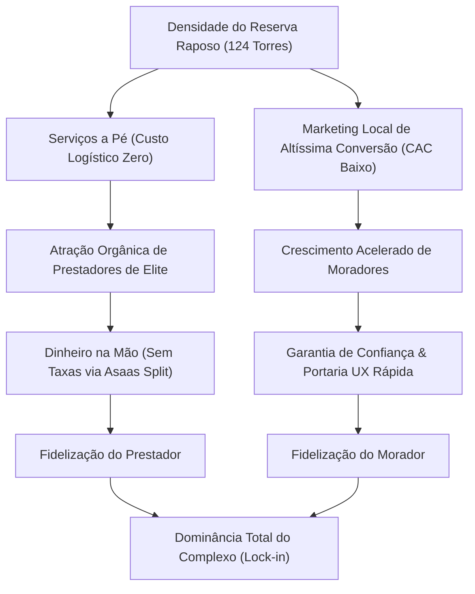

# Análise de Valor e Unit Economics: Reserva Serviços
> Versão: 1.0.0  
> Status: Concluído  
> Autor: @maestro & @ba (Analista de Valor / Engenheiro Financeiro)  

Esta análise de viabilidade econômica e Unit Economics foi desenvolvida para estruturar o modelo de monetização, os limites de margem líquida e o ponto de equilíbrio operacional (Break-Even) da plataforma, sob o nome oficial de **Reserva Serviços**, considerando a baixa necessidade de capital inicial (Low-Capital Bootstrapping) e o foco estritamente hiperlocal no megacomplexo Reserva Raposo (sem fazer uso de marcas proprietárias ou de imagem do empreendimento).

---

## 1. A Tese de Valor Hiperlocal (Vantagem Geográfica)

O megacomplexo Reserva Raposo possui uma densidade demográfica extraordinária (aproximadamente 80.000 moradores em 124 torres). Essa escala urbana compacta gera três vantagens econômicas exclusivas:

1.  **Custo Logístico Zero para o Prestador (Carga de Eficiência):**
    *   Em plataformas gerais (ex: GetNinjas, Parafuzo), o prestador gasta entre **20% e 35% do seu ganho diário** com deslocamento (ônibus, metrô, combustível) e perde até 3 horas diárias no trânsito.
    *   No Reserva Raposo, o prestador se desloca a pé entre as torres. Ele pode realizar até 3 diárias rápidas ou reparos no mesmo dia, reduzindo seu custo logístico a R$ 0,00 e elevando sua renda útil real.
2.  **Custo de Aquisição de Cliente (CAC) Extremente Baixo:**
    *   Geofencing digital ultra-estrito via Meta/Google Ads (raio de 1 km) garante que cada centavo de anúncio seja exibido apenas para pessoas que moram nas torres do complexo.
    *   A divulgação orgânica boca-a-boca e grupos locais de WhatsApp aceleram a virality, derrubando o CAC para níveis marginais.
3.  **Rede de Confiança Fechada (Network Lock-in):**
    *   Diaristas e técnicos que residem ou atuam no próprio complexo desenvolvem vínculos de reputação local. Uma vez que o prestador entra na rede e se valida como seguro, o morador não arrisca contratar ninguém de fora.

---

## 2. Unit Economics Detalhado (A Anatomia da Transação)

Analisamos a rentabilidade de um serviço padrão com valor final de **R$ 100,00** pago pelo morador, dividida entre os meios de pagamento (PIX e Cartão de Crédito), considerando a decisão estratégica de **absorver todas as taxas do Asaas na margem da startup** como benefício de atração.

### Cenário A: Pagamento via PIX (Split Instantâneo)

O PIX é o principal motor de liquidez para garantir o "Dinheiro na Mão" no término do trabalho.

| Rubrica Financeira | Valor absoluto | % do Total | Descrição / Regra Contábil |
| :--- | :--- | :--- | :--- |
| **Geral Pago pelo Morador** | **R$ 100,00** | **100%** | Valor final do agendamento de serviço. |
| **Repasse Líquido do Profissional** | **R$ 80,00** | **80,00%** | Repasse livre de qualquer taxa, creditado na hora do checkout. |
| **Taxa Fixa do Gateway Asaas** | **R$ 0,99** | **0,99%** | Tarifa de processamento e Split do PIX (absorvida pela plataforma). |
| **Micro-Seguro IZA (Acidentes)** | **R$ 1,00** | **1,00%** | Ativado por API por diária ativa (absorvido pela comissão). |
| **Fundo Mutualista (Avarias/Garantia)** | **R$ 0,30** | **0,30%** | Retenção interna de 1,5% sobre a nossa comissão de R$ 20,00. |
| **Imposto Simples Nacional (NFS-e)** | **R$ 1,20** | **1,20%** | Alíquota de 6% (Anexo III) aplicada unicamente sobre os R$ 20,00 de comissão. |
| **Margem Operacional Líquida (Startup)**| **R$ 16,51** | **16,51%** | Margem líquida que sobra para o caixa da plataforma. |

---

### Cenário B: Pagamento via Cartão de Crédito (À Vista - Recebimento em 30 Dias)

Para moradores que preferem conveniência e prazo, o cartão de crédito possui taxas maiores que o PIX.

| Rubrica Financeira | Valor absoluto | % do Total | Descrição / Regra Contábil |
| :--- | :--- | :--- | :--- |
| **Geral Pago pelo Morador** | **R$ 100,00** | **100%** | Valor final do agendamento de serviço. |
| **Repasse Líquido do Profissional** | **R$ 80,00** | **80,00%** | Creditado em saldo futuro do profissional (liberado em 30 dias). |
| **Taxa de Processamento Asaas (Cartão)** | **R$ 2,99** | **2,99%** | Taxa média de cartão de crédito à vista (absorvida pela plataforma). |
| **Micro-Seguro IZA (Acidentes)** | **R$ 1,00** | **1,00%** | Ativado por API por diária ativa (absorvido pela comissão). |
| **Fundo Mutualista (Avarias/Garantia)** | **R$ 0,30** | **0,30%** | Retenção interna de 1,5% sobre a nossa comissão de R$ 20,00. |
| **Imposto Simples Nacional (NFS-e)** | **R$ 1,20** | **1,20%** | Alíquota de 6% (Anexo III) aplicada unicamente sobre os R$ 20,00. |
| **Margem Operacional Líquida (Startup)**| **R$ 14,51** | **14,51%** | Margem líquida que sobra para o caixa da plataforma. |

> **Nota sobre Antecipação de Cartão:** Se o profissional optar por sacar o saldo de cartão de crédito imediatamente no término do trabalho ("Dinheiro na Mão"), o Asaas efetuará a antecipação cobrando uma taxa adicional de aproximadamente **2% a 3,5%**. Conforme o PRD, **esta taxa específica de antecipação do cartão será repassada integralmente ao prestador**, pois é uma opção voluntária de antecipação financeira dele, preservando a nossa margem de R$ 14,51.

---

## 3. Análise de Custos Operacionais e Break-Even Point (Ponto de Equilíbrio)

### A. Custos Fixos Mensais Iniciais (Estrutura Enxuta - MVP)
*   **Servidores e Banco de Dados (Supabase/Host):** R$ 0,00 (dentro do free tier no início / escalando para R$ 130,00/mês).
*   **Contabilidade Simplificada (MEI/Simples):** R$ 200,00/mês.
*   **Ferramentas Administrativas & Suporte (WhatsApp Business API):** R$ 150,00/mês.
*   **Orçamento de Tráfego Pago Local (Meta/Google Ads):** R$ 600,00/mês.
*   **Total de Custos Fixos Estimados (MVP):** **R$ 950,00 / mês**.

### B. Cálculo de Break-Even (Ponto de Equilíbrio)
Considerando um tíquete médio de serviço de **R$ 150,00** (limpezas custam de R$ 150 a R$ 220; maridos de aluguel custam R$ 80 a R$ 150):
*   **Comissão Média de 20% da Startup:** R$ 30,00 por serviço.
*   **Custos Variáveis Médios por Serviço (Gateway + Seguro + Imposto + Fundo):** R$ 6,00.
*   **Margem de Contribuição Líquida Média:** R$ 24,00 por serviço.

$$\text{Ponto de Equilíbrio} = \frac{\text{Custo Fixo Mensal}}{\text{Margem de Contribuição Média}} = \frac{\text{R\$ 950,00}}{\text{R\$ 24,00}} \approx 40 \text{ serviços / mês}$$

*   **Meta de Break-Even:** Apenas **40 agendamentos concluídos por mês** (cerca de 10 serviços por semana em um condomínio com 22.000 apartamentos) para zerar todos os custos operacionais e de publicidade da plataforma. Isso representa **0,18% de penetração** no mercado do Reserva Raposo.

---

## 4. Projeções Financeiras e Potencial de Escala

À medida que o boca-a-boca se consolida entre as 124 torres, as projeções escalam com baixíssimo aumento de custo fixo:

| Métrica de Escala | Cenário Conservador (Mês 3) | Cenário Moderado (Mês 6) | Cenário Otimista (Mês 12) |
| :--- | :--- | :--- | :--- |
| **Serviços / Mês** | 150 | 600 | 2.000 |
| **Serviços / Dia** | 5 | 20 | 66 |
| **Faturamento Bruto GMV** | R$ 22.500,00 | R$ 90.000,00 | R$ 300.000,00 |
| **Faturamento Startup (20%)** | R$ 4.500,00 | R$ 18.000,00 | R$ 60,000.00 |
| **Despesas Variáveis Totais** | R$ 900,00 | R$ 3.600,00 | R$ 12.000,00 |
| **Despesas Fixas + Marketing**| R$ 1.200,00 | R$ 3.000,00 | R$ 8.000,00 |
| **Fundo Mutualista Acumulado**| R$ 337,50 | R$ 1.350,00 | R$ 4.500,00 |
| **Lucro Líquido Operacional** | **R$ 2.400,00** | **R$ 11.400,00** | **R$ 40.000,00** |

*   *Nota de Projeção:* No cenário otimista de 12 meses (2.000 diárias/mês), a plataforma atinge apenas **9% de penetração mensal** no condomínio (assumindo que cada morador ativo agende apenas 1 vez por mês), gerando um lucro líquido espetacular de **R$ 40.000,00 mensais** com custo estrutural mínimo.

---

## 5. Matriz de Valor e Diferenciais Estratégicos (Value Engine)

---

## 6. Parecer de Viabilidade Econômica (Conclusão do `@ba`)

**RECOMENDAÇÃO: APROVADO PARA DESENVOLVIMENTO IMEDIATO.**

A modelagem financeira demonstra que a plataforma **Reserva Serviços** possui uma **viabilidade econômica formidável**. O risco de capital é extremamente mitigado pela estratégia de intermediação C2C, split imediato via Asaas (eliminando custódia complexa regulada pelo BACEN) e a substituição de apólices tradicionais caras pelo Fundo Mutualista de 1,5%. 

O retorno financeiro marginal de cada R$ 1,00 investido em publicidade local trará um retorno em cascata (Network Effect) que blindará o complexo contra gigantes do mercado tradicional de serviços. O foco em dar ao profissional o ganho líquido real sem tarifas de saque é a melhor jogada de crescimento possível.
