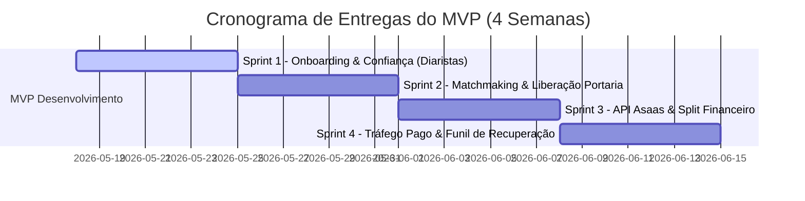

# Plano de Entregas e Fases do MVP: Reserva Serviços
> Versão: 1.0.0  
> Status: Planejamento Concluído  
> Autor: @maestro (Orquestrador) & @ba (Analista de Negócios)  

Para viabilizar um lançamento ultra-rápido, de baixo custo e com validação imediata de mercado, dividimos o PRD-001 em **4 Marcos de Entrega de Valor (Milestones)** estruturados em formato de Sprints semanais. 

Cada fase entrega um subproduto funcional e testável que reduz o risco do negócio e valida premissas críticas perante os moradores e prestadores do Reserva Raposo, agindo a plataforma sob a denominação independente de **Reserva Serviços** (sem utilizar imagens oficiais ou marcas do empreendimento).

---

## 🗺️ Mapa de Valor e Sprints (Visão Geral)

---

## 📦 Detalhamento das Entregas por Milestone

### 📌 Milestone 1: Base de Confiança e Onboarding do Prestador (Sprint 1)
*   **Objetivo de Negócio:** Capturar, triar e aprovar os primeiros 20 profissionais de elite (diaristas/encanadores) da região para termos "estoque" de serviços no lançamento. Sem prestador confiável, não há app.
*   **Entregas Claras (DEV):**
    1.  **Formulário de Cadastro do Prestador (Mobile-First):** Coleta de Selfie, Documento Oficial (RG/CPF), Contato e Atestado de Antecedentes Criminais.
    2.  **Painel de Administração (Backoffice Simplificado):** Área restrita para a equipe validar a identidade e o atestado de antecedentes criminais.
    3.  **Segurança LGPD - Deleção Física:** Rotina de deleção física automática do arquivo PDF de antecedentes criminais imediatamente após a validação do administrador, registrando apenas o status `is_verified: true` no Supabase.
*   **Entrega de Valor:** Garantia de uma base inicial triada e apta a atuar, com 100% de conformidade com a LGPD sobre dados sensíveis.

---

### 📌 Milestone 2: Agendamento & Liberação Condominial (Sprint 2)
*   **Objetivo de Negócio:** Permitir que o morador solicite um serviço e consiga autorizar a entrada do prestador de forma rápida, contornando a burocracia do condomínio.
*   **Entregas Claras (DEV):**
    1.  **App do Morador (Interface de Agendamento):** Telas de seleção de Faxina, Passadoria e Marido de Aluguel, com calendário e escolha de horários.
    2.  **Algoritmo de Matchmaking Uber-Like:** Sistema de transmissão de chamados sob demanda via Realtime para os prestadores da região, permitindo aceitação ou rejeição facultativa.
    3.  **Trava Antivínculo & Trava do Silêncio:**
        *   Bloqueio eletrônico para impedir que um morador contrate o mesmo prestador mais de 2 vezes por semana.
        *   Bloqueio de horários ruidosos de reparo fora do intervalo 9h-17h (dias úteis) e 9h-12h (sábados).
    4.  **Botão "Copiar Dados para Portaria" (UX Clipboard):** Recurso que copia os dados de acesso do profissional formatados com um clique para colar no WhatsApp ou app da portaria da torre.
*   **Entrega de Valor:** Experiência de match fluida, segura, em conformidade com o regimento de silêncio e sem atrito na entrada do megacomplexo.

---

### 📌 Milestone 3: O Motor Financeiro - Integração Asaas (Sprint 3)
*   **Objetivo de Negócio:** Viabilizar o fluxo de pagamentos 100% online, garantindo o "Dinheiro na Mão" imediato do prestador e a comissão da plataforma, com proteção a fraudes.
*   **Entregas Claras (DEV):**
    1.  **Integração API Asaas Checkout:** Processamento de pagamentos do morador via PIX e Cartão de Crédito.
    2.  **Motor de Split Automatic em Tempo Real:** Divisão automatizada (80% na carteira digital do prestador e 20% na conta da startup), com **absorção de taxas do gateway na nossa comissão de 20%** para PIX.
    3.  **Painel Financeiro do Profissional ("Saque Instantâneo"):** Exibição do saldo Asaas e botão de transferência imediata PIX, além de opção de antecipação automática para cartões.
    4.  **Log Digital de Evidências (Defesa de Chargeback):** Coleta sistemática de check-in/check-out via GPS, fotos do serviço concluído e logs de autorização de portaria, integrados para defesa e contestação automatizada de fraudes de cartão.
*   **Entrega de Valor:** Operação financeira legalizada, atrativo viral do repasse instantâneo e blindagem total contra golpes de chargebacks.

---

### 📌 Milestone 4: Go-to-Market, Tráfego Pago & Recuperação de Leads (Sprint 4)
*   **Objetivo de Negócio:** Lançar a plataforma, adquirir os primeiros 100 clientes moradores no Reserva Raposo e converter leads que iniciaram o cadastro mas não finalizaram.
*   **Entregas Claras (DEV / MKT):**
    1.  **Landing Page de Alta Conversão:** Página de vendas hiperlocal com depoimentos de segurança e botão direto de chamada de serviço.
    2.  **Funil de Cadastro Incompleto (Active Recovery):** Webhook integrado que detecta se o morador abandonou o checkout ou o cadastro. Os dados básicos capturados entram em um painel administrativo para que o suporte faça contato humano direto pelo WhatsApp para tirar dúvidas e fechar o serviço.
    3.  **Campanhas de Tráfego Pago:** Ativação dos anúncios Meta e Google segmentados geograficamente num raio de 1 km do condomínio.
*   **Entrega de Valor:** Primeiro lote de 100 diárias concluídas, validação prática da taxa de recorrência e ativação comercial da máquina de vendas local.

---

## 📈 Critérios de Parada de QA e Validação (Por Milestone)

Ao fim de cada Sprint semanais, o agente **`@qa`** deverá validar as seguintes metas técnicas para avançarmos de etapa:

*   **Fase 1 (Confiança):** Cadastro funcional enviando arquivos Supabase com deleção de PDFs funcionando 100%. Apenas a flag `is_verified` gravada no banco de dados local.
*   **Fase 2 (Agendamento):** Algoritmo de matching distribuindo em menos de 5 segundos; Travas de silêncio e de 2 diárias semanais impedindo agendamentos ilegais com sucesso em simulação de teste. Botão de clipboard copiando dados corretamente.
*   **Fase 3 (Financeiro):** Splits do Asaas testados em Sandbox, repassando o valor líquido redondo de 80% ao profissional e retendo a taxa do Asaas na nossa conta corporativa. Geração de PDF/dados do Log Digital de Evidências em caso de cancelamento/checkout simulado.
*   **Fase 4 (Go-Live):** Landing page carregando em menos de 1.8s e webhook de abandono de cadastro disparando e salvando o contato do cliente em menos de 10 segundos pós-desistência.
